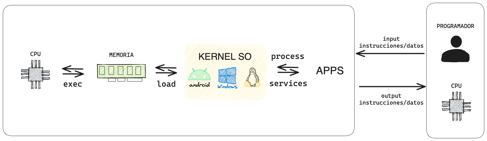

El sistema operativo es el primer programa que se ejecuta, encargado de proporcionar servicios para controlar y compatibilizar el hardware. Gracias a los sistemas operativos, los programadores desarrollamos aplicaciones para hardware con diversas características.

Existen dos principales familias de sistemas operativos: Windows y la familia Unix, que incluye, entre otros, a Linux, macOS, iOS y Android.

Aunque Windows es compatible con las principales herramientas y es una opción válida para el desarrollo web, la mayoría de tecnologías y prácticas están basadas en sistemas Unix. Además, los servidores web suelen ejecutar sistemas operativos Unix, lo que mejora la coherencia y minimiza problemas de integración al comprender y desarrollar en un entorno similar.
