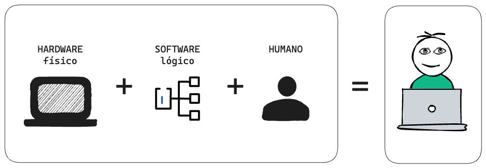

> El hombre es un animal que utiliza herramientas... sin ellas no es nada, con ellas lo es todo.
>
> - Thomas Carlyle. (1833). Sartor Resartus, Libro 1, Capítulo 4.

Un sistema informático posibilita que una persona utilice herramientas (hardware) a través de reglas y procedimientos (software) para procesar, almacenar y llevar a cabo tareas específicas con datos.

