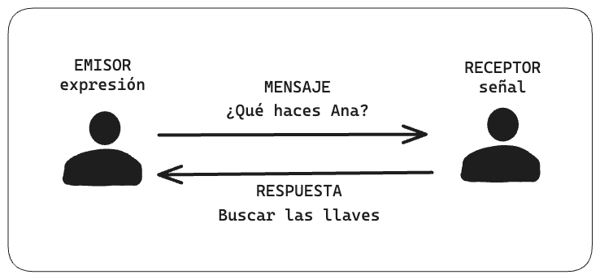
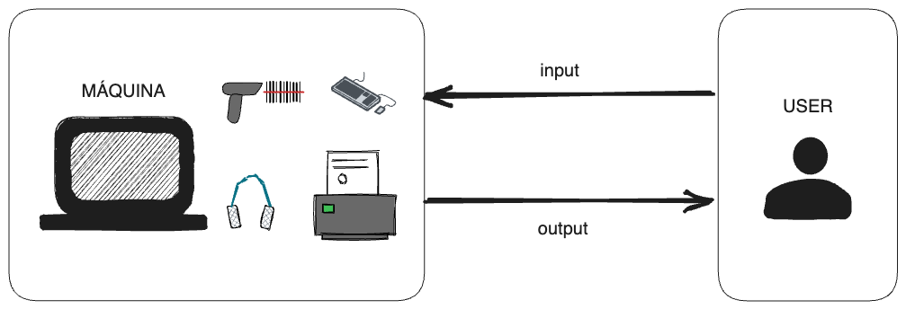
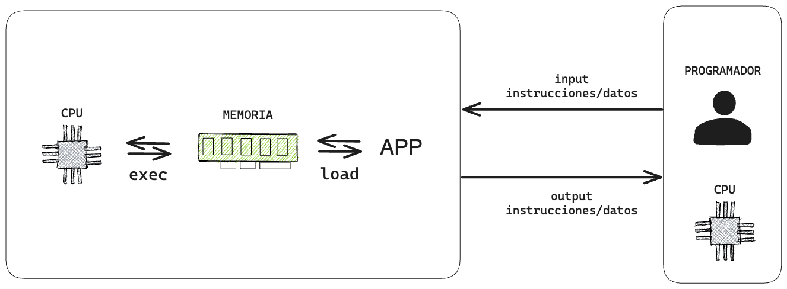

La comunicación es la columna vertebral de la interacción, incluso en el mundo digital.

Los usuarios “dialogan” con las máquinas para obtener ayuda en la resolución de tareas cotidianas.

Como programadores, nos convertimos en "amigos de las máquinas", usuarios avanzados que enseñamos a estos dispositivos a realizar tareas tanto para otros usuarios como para otras máquinas.

